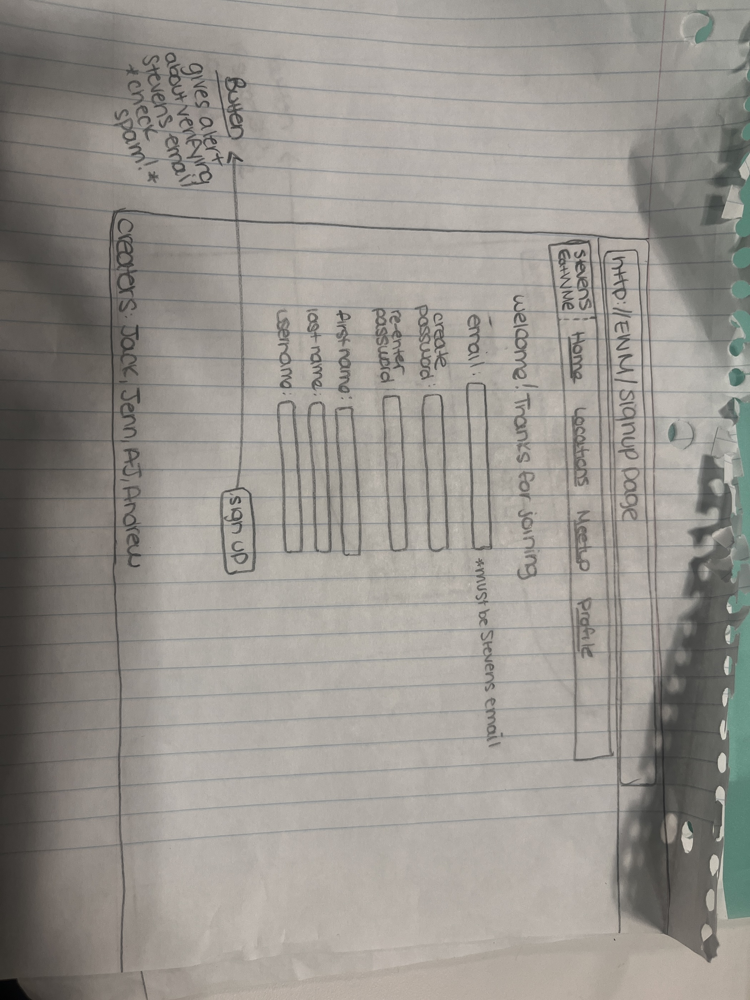
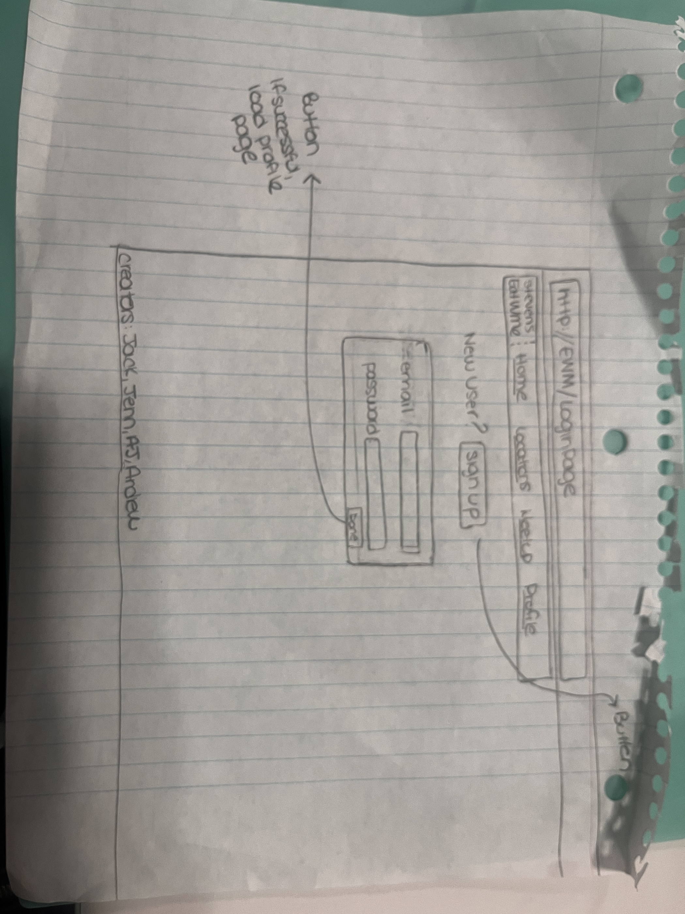
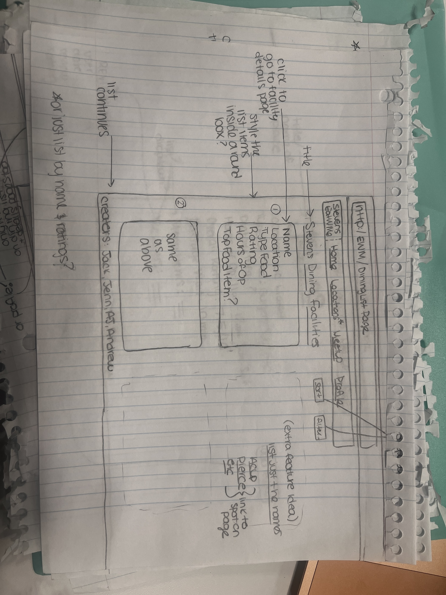
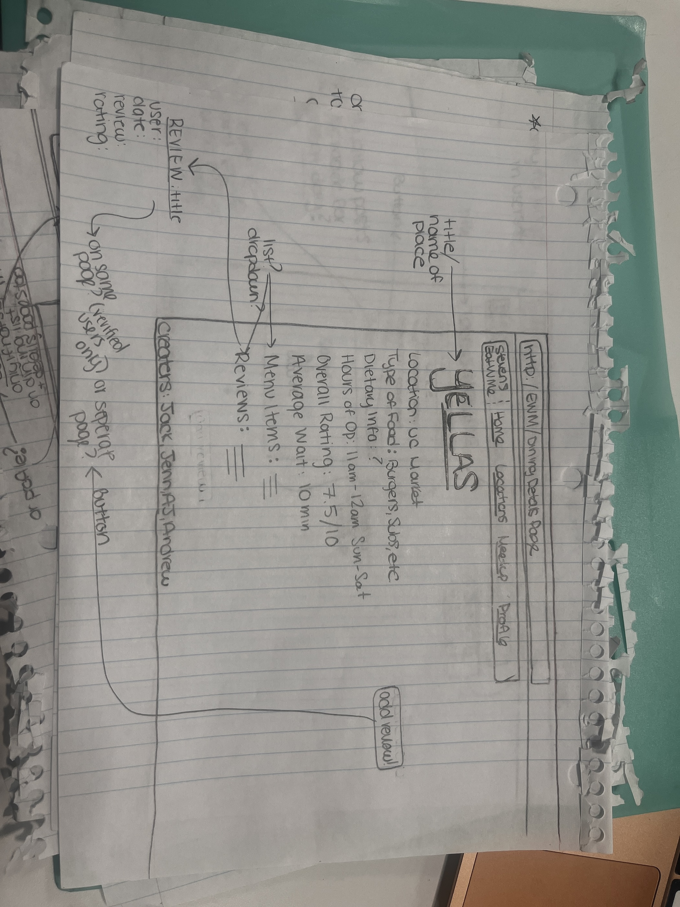
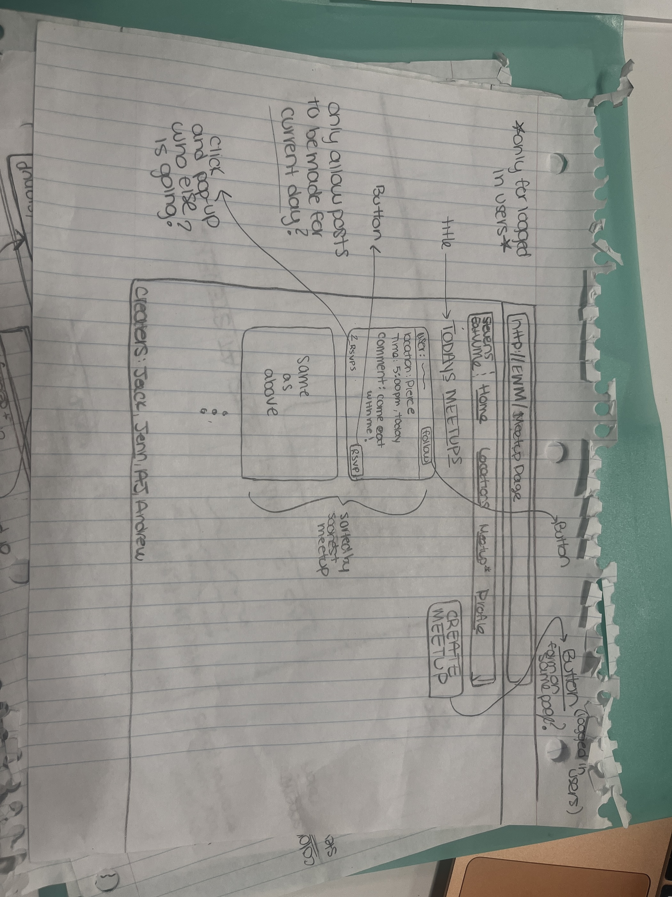
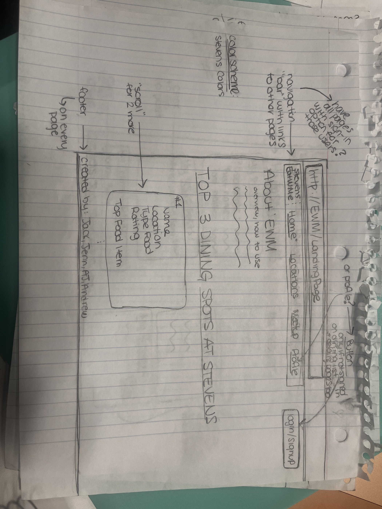
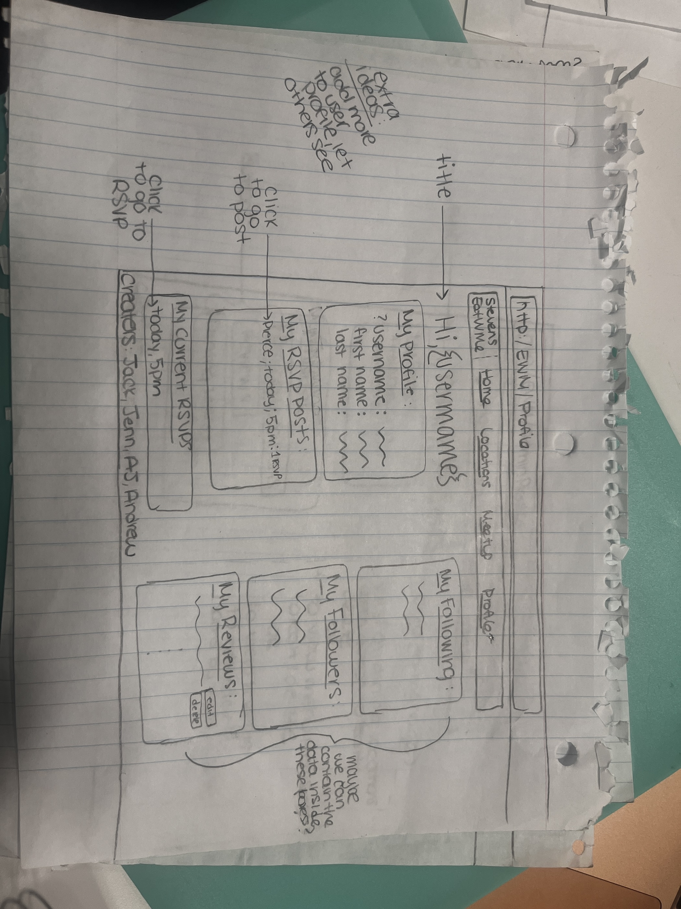
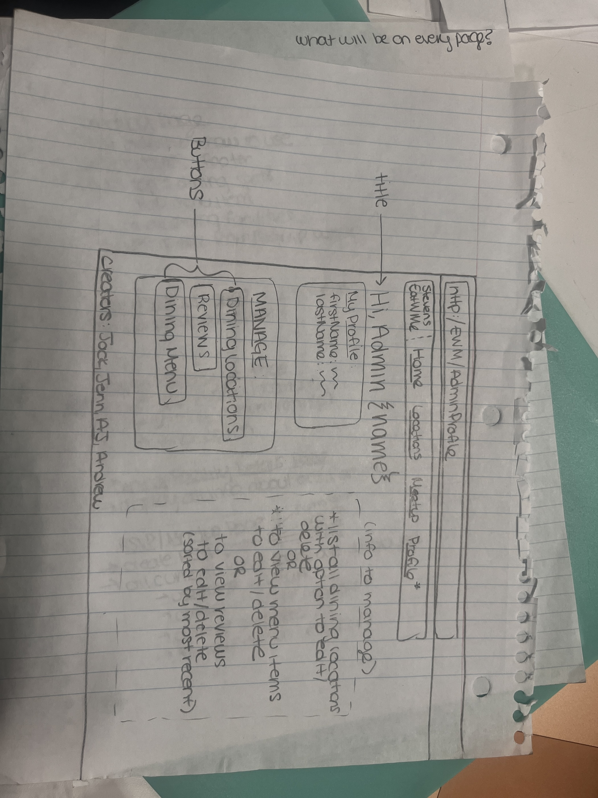

# EatWithMe
Team Members
Andrew Staniaszek
Jack Nolan 
Alexander Lupia
Jenn Alexander

---

**Introduction**
Deciding where to eat on campus can be challenging and overwhelming, especially with so many dining locations and ever-changing menus. Our platform makes it easy for Stevens Institute of Technology students to share real-time reviews, ratings, and updates about campus dining locations. Whether you’re looking for the best meal at Pierce Dining Hall, the shortest wait time at the Gateway Cafe, or simply want to see what’s available to eat before heading out, our application provides the information you need. Additionally, our platform fosters community by allowing students to coordinate meal-time meetups, so no student has to eat alone. With all these features in one place, EatWithMe will revolutionize the dining experience at Stevens.

---

**Purpose**
The purpose of this application is to create a central hub for Stevens students to share dining experiences, making it easier to decide where, when, and what to eat. Users can rate individual food items, review restaurants, and provide real-time updates on wait times and availability at all campus dining locations. For those looking to dine at Pierce Dining Hall, students can post what food is currently available that day and attach images so others know what to expect. Beyond reviews and updates, the application encourages social dining and community by allowing students to set up and RSVP for group meals. Whether you’re a freshman looking to meet new people or you just don’t want to eat alone, our platform helps bring Stevens students together over shared meals.

---

**How to Use**
To use EatWithMe, start by browsing the landing page to see the top-rated dining locations and their most popular menu items on campus. If you want to explore more options, click “List all Dining Facilities” to view every restaurant and filter them by dietary preferences, average wait time, or overall rating. You can click on any dining location to see details like menu items, reviews, and hours. To contribute your own reviews, RSVP to meal meetups, or follow other students, simply sign up using your Stevens email and verify your account through the email link. Once logged in, you can post or edit reviews, join others for meals through the RSVP page, and build a network of students you enjoy eating with.

---

_**Core Features**_

**Landing Page**
- Provides a brief overview of EatWithMe and how to use it. Creator names will be listed in the footer.
- Lists and ranks the top 3 dining locations at Stevens, and will feature the top menu items at each location.
- Will have a link “List all Dining Facilities” that brings the user to the Dining Facility List Page which lists all restaurants and menu items
- The top right corner will display a login/signup button to allow the user to log into their account, or create one. 

**Dining Facility List Page**
- Lists all dining locations on campus. Users can also sort dining options in order based on their ratings.
- Filter that generates specific lists of dining options based on user preferences (such as dietary preferences/restrictions, preferred wait time, or preferred rating). 

**Dining Facility Details Page**
Displays information about a single dining location, including:
- Name.
- Location.
- Type of food.
- Dietary Information.
- Hours of operation for each day of the week.
- All menu items: 
- Each menu item's overall rating.
- All reviews about each item.
- Reviews can also be sorted by time or ratings.
- Overall Location Rating.
- Average Wait Time.
- All general reviews about the dining location itself.

**User Profile Page**
This page is created when a Stevens student creates an account.
Displays the user’s:
- Username
- Reviews
- All reviews posted by the user. 
- Users can create, update, and delete (their own) reviews.
- Following List
Each verified user can follow other users through RSVP postings (each RSVP post will have a button with it that allows the user viewing the post to follow the reviewer (this will not be a request; it will be an immediate follow).
Users have the ability to delete users from their following list. If the user clicks on the profile of a user they are following, that user’s current RSVP posts will be displayed.
RSVPs
All RSVP posts made by this user will be displayed.

**RSVP Page**
- On this page, users can create an RSVP post for a specific dining location, date, and time. The users can also add a short comment along with the RSVP post.
- All RSVPs for the current day will be posted on this page. RSVPs will be automatically sorted by most recently posted.
- Each posted RSVP will display the username of the user who posted it. Any registered user who views the RSVP post will have the option to RSVP to the post. This will display the user’s username alongside the post to indicate that they plan on attending. 
- User’s who view the RSVP post can also “follow” the user who posted the RSVP.

**Admin Profile Page**
- Through this page, verified admins will have the ability to:
- Create/update/remove dining locations.
- Create/update/remove menu items from any dining location. 
- Remove other user reviews.
- The admins will obtain the dining location and menu item information from https://dineoncampus.com/stevensdining and/or GrubHub

---

_**Extra Features**_
- Report Feature for inappropriate comments and to report a restaurant that no longer exists. Reports can be viewed and handled accordingly by Admin users.
- An anonymous user feature to allow registered users to make anonymous comments about restaurants and menu items. The user must still be a verified user who is a Stevens student. This feature will allow the user to hide their username on a given review they create/update. The username of the user who created/updated the post will still be logged on the backend as the user who posted the review, for Admin users to view.  

## 🎨 Design References

These reference images help visualize the design direction for **EatWithMe** — including layout, colors, and interface inspiration:

  
  
  
  
  
  
  

> _These are for design inspiration only and not part of the application logic._
